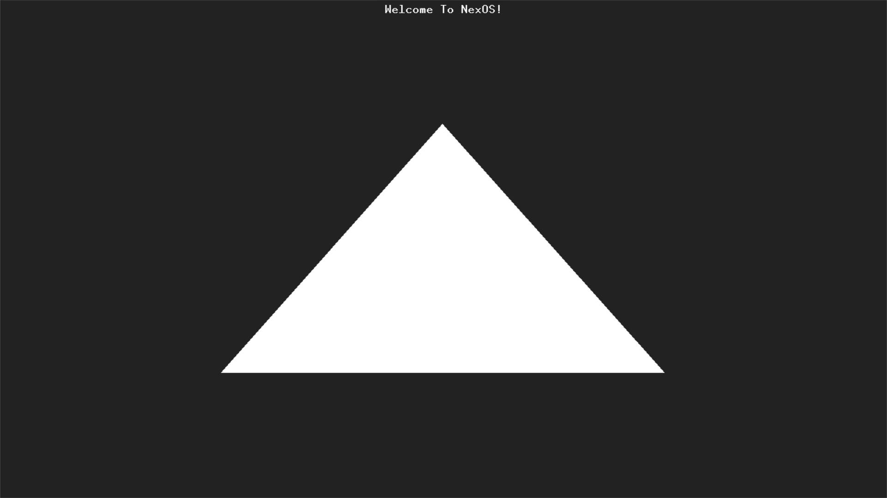
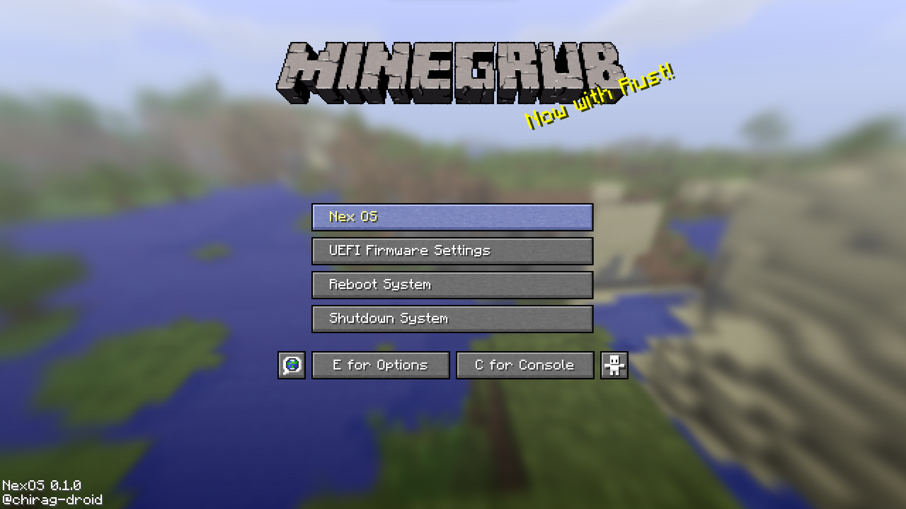

# NexOS

NexOS is a hobby operating system written in rust.

## WIP

Nex OS                  | Grub Menu
:----------------------:|:-----------------------------:
 | 

## Contents

* [Documentaion](#documentation)
* [Toolchain](#toolchain)
* [Licence](#licence)

## <a name="documentation"> Documentation </a>

Refer to comments and README files in each folder.

Useful Sites:

* [OSDev wiki]
* [Archlinux wiki]
* [UEFI Spec]
* [Rust UEFI Target]

[OSDev wiki]: http://wiki.osdev.org
[Archlinux wiki]: https://wiki.archlinux.org/
[UEFI Spec]: https://uefi.org/specifications
[Rust UEFI Target]: https://doc.rust-lang.org/rustc/platform-support/unknown-uefi.html

## <a name="toolchain"> Toolchain </a>

### Linux or WSL

Use Windows WSL or Linux. Run `make` to see if everything runs and install the required tools.

`make qemu` will build the iso and also start qemu.

### Rust Toolchain
https://www.rust-lang.org/tools/install

### <a name="vm"> QEMU virtual machine </a>

https://www.qemu.org/download/

`qemu-system-x86_64` command should be available.

## <a name="licence"> Licence </a>

This project is licenced under MIT. See the `LICENCE` for details.
