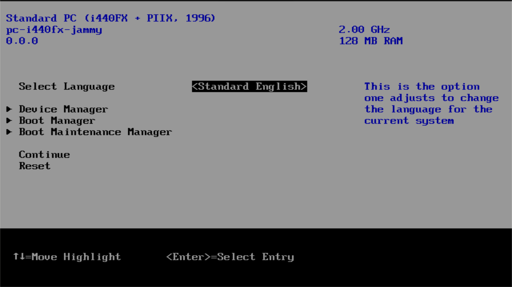

# Firmware

OVMF firmware enables support for UEFI within Virtual Machines.

UEFI implementation is usually stored in a ROM inside your mainboard. We need this to emulate UEFI environment in a VM.

[Read the OVMF FAQ](https://github.com/tianocore/tianocore.github.io/wiki/OVMF-FAQ)

## Licence

This project is using open source `BSD+Patent` licence. See the `LICENCE` for details.
